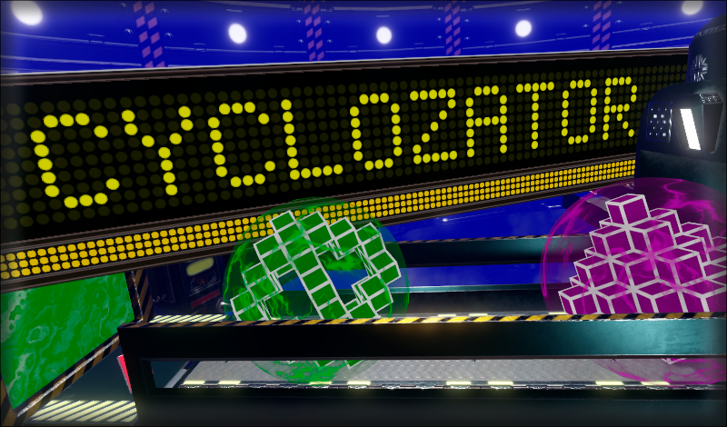

  

______
> In the game “Cyclozator" you have to do an important job - to disarm the Distortion figures. By earning points and improving the Cyclozator for the next attempt, the player can complete endless levels to become the world's best Cyclozator rotator.

>> Somewhere very far away, perhaps even beyond our universe, there is a profession as a Cyclozator rotator.
Every morning, the rotator checks the instrument readings and lowers the huge lever that starts the Cyclozator, which is a stabilizer of time and space. There is a rumble, the floor shakes, and for a moment other worlds and epochs flash before the rotator's eyes — this Cyclozator begins to absorb Distortions. Then the Distortion crystals emerge from the injector, taking the form of colored figures locked in a protective shell.
The rotator's job is to disarm the Distortion figures with a suitable neutralizer so that time and space remain stable. It requires speedy reactions, good memory and a bit of luck. The better he does, the less chaos and destruction there will be in the world.
Every evening the rotator returns home tired, but he knows that his efforts to help maintain order in all universes and keep them safe and sound.
Ready to get to work?
